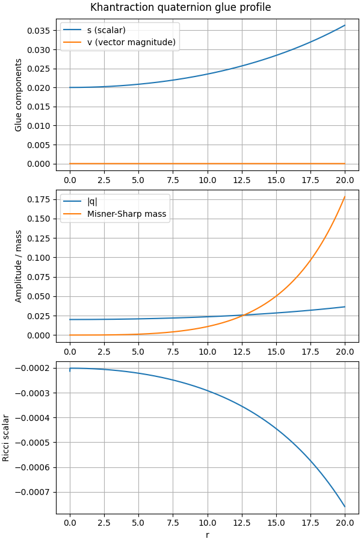

# Khantraction Research Note: Spacetime Knots

## Source and scope
This summary extracts the current Khantraction manuscript: a quaternion-based field theory where particles are knots in spacetime. The document digests the conceptual picture, the governing Lagrangian, the numerical profile, and the relation to the quaternion exponential in the MTW appendix.

## Executive summary
1. **Khantraction field:** The glue is a quaternion \(q=s+\vec v\cdot\vec\tau\) with norm \(|q|^2 = s^2 + \vec v\cdot\vec v\). A quartic potential and couplings \(\xi R|q|^2\) and \(\lambda|q|^2F^2\) source localized curvature pockets, so \(\mathcal{L}=\tfrac{1}{2}g^{\mu\nu}(\partial_\mu s\partial_\nu s+\partial_\mu\vec v\cdot\partial_\nu\vec v)-U(|q|)+\xi R|q|^2-\tfrac{1}{4}F^2-\lambda|q|^2F^2\).
2. **Photon vs. electron:** Null-aligned glue ( \(s\to0\), \(\vec v\) along a lightlike direction) produces the limit case where the knot lets spacetime flow through instantly; nonzero \(s\) makes the fold timelike, generating inertia and charge.
3. **Quaternion geometry:** Appendix A shows the exponential \(e^q\) blends scale and rotation, while its Jacobian measures how varying \(s,v\) changes the contraction. Our linearized equations have the same structure, so the knot’s response to perturbations mirrors the quaternion sensitivity.
4. **Numerical evidence:** The RK4 solver with \(m_{\text{glue}}=0.1\), \(\lambda_q=0.01\), \(\xi=0.002\) and small initial data reaches \(r=20\) with \(|q|\approx0.036\), \(m(r)\approx0.178\), and \(R\approx-7.6\times10^{-4}\). The profile is plotted in Figure 1.

## Highlights
- The scalar part \(s\) is the knot’s tightness knob: loosening it pushes the solution toward the photon limit and closes the mass gap.
- Fluctuation equations \(\delta s''+P_s\delta s+Q_s\delta v=0\) and \(\delta v''+P_v\delta v+Q_v\delta s=0\) quantize the knot, giving particle states and ensuring antisymmetry via topological winding.
- The quaternion exponential naturally encodes both the spatial orientation of the fold and how it scales, bridging geometry and quantum field theory.

## Numerical profile and figure

The plot shows the scalar/vector glue components, the norm \(|q|\), the Misner–Sharp mass function, and the Ricci scalar as functions of radius. The knot tapers into flat space around \(r\sim20\), consistent with a self-contained particle-like curvature pocket.
